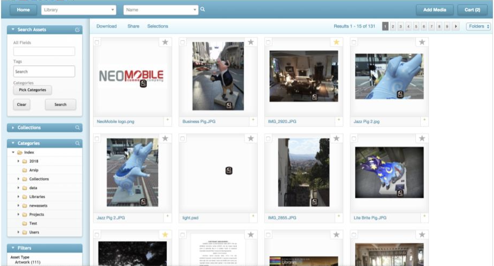

# Digital Asset Management System

This repository contains a Digital Asset Management System built using Django (backend) and ReactJS (frontend). The application is containerized using Docker, making it easy to set up and run on any machine.



## Prerequisites

Before starting, ensure you have Docker installed on your machine. You can follow the installation guides based on your operating system:

- **Mac:** [Docker for Mac Installation Guide](https://docs.docker.com/docker-for-mac/install/)
- **Windows:** [Docker for Windows Installation Guide](https://docs.docker.com/docker-for-windows/install/)

## Getting Started

### Starting the Application

To start the application, simply run the following command:

```bash
docker-compose up -d
```

Once the Docker containers are up and running, you can access the application using the following URLs:

- **Django Backend:** [http://localhost:8000](http://localhost:8000)
- **React Frontend:** [http://localhost:3000](http://localhost:3000)

### Rebuilding Docker Images

If you make changes to the `requirements.txt` (Python dependencies) or `package.json` (Node.js dependencies), you will need to rebuild the Docker images to incorporate these changes. Use the command below to rebuild the images:

```bash
docker-compose up -d --build
```

## Project Structure

Here is a brief overview of the project structure:

```
application
├── backend_entry/                 # Django project files
│   ├── manage.py
│   ├── requirements.txt     # Python dependencies
│   └── ...
├── frontend_entry/                # React project files
│   ├── package.json         # Node.js dependencies
│   └── ...
├── docker-compose.yml       # Docker Compose configuration
└── Dockerfile                
```


